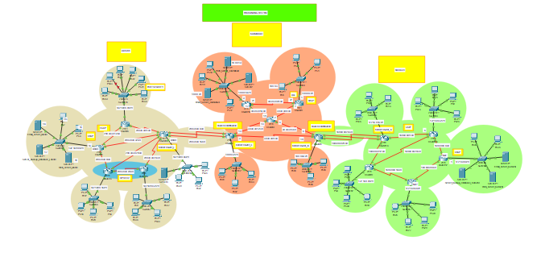

# Pak-Banking-System-Using-Cisco-Packet-Tracer

<h2>Functionalities</h2>

<h4>- Every District have only access to modify their particular Area.</h4>
<h4>- Every Area of a district have access to modify their Sectors/Block in which their supply is going on.</h4>
<h4>- Area must be able to Encrypt or block the specific IP/Website in their sectors.</h4>
